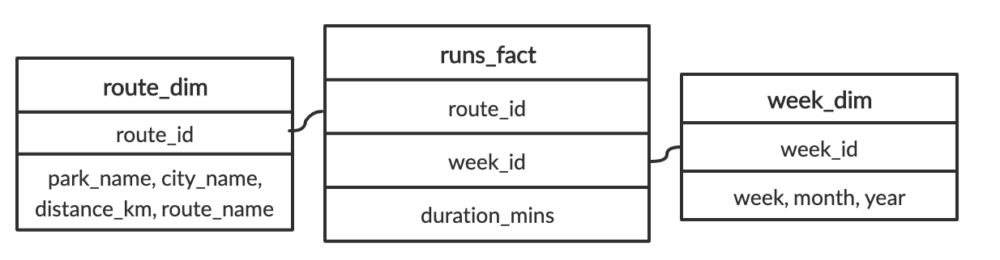
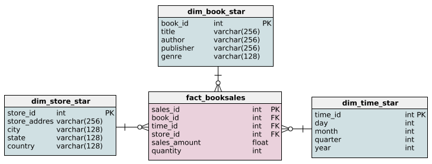
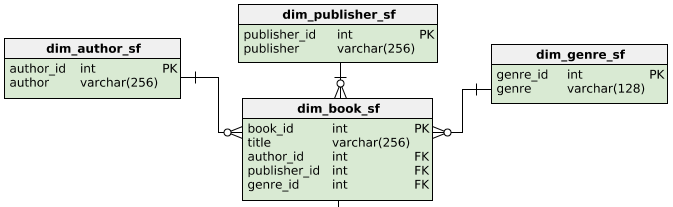
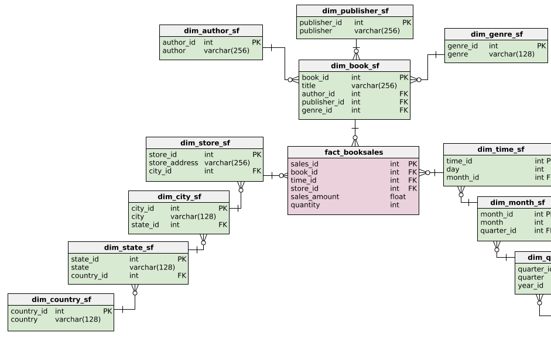

# Database design
## Chapter 1
### _OLTP and OLAP_
#### Exercise
##### OLAP vs. OLTP
You should now be familiar with the differences between OLTP and OLAP. In this exercise, you are given a list of cards describing a specific approach which you will categorize between OLAP and OLTP.
##### Question
###### Result


#### Exercise
##### Which is better?
##### Question
Which is better?
The city of Chicago receives many 311 service requests throughout the day. 311 service requests are non-urgent community requests, ranging from graffiti removal to street light outages. Chicago maintains a data repository of all these services organized by type of requests. In this exercise, `Potholes` has been loaded as an example of a table in this repository. It contains pothole reports made by Chicago residents from the past week.

Explore the dataset. What data processing approach is this larger repository most likely using?
```text
OLTP because this table could not be used for any analysis.
OLAP because each record has a unique service request number.
OLTP because this table's structure appears to require frequent updates.
OLAP because this table focuses on pothole requests only.
```
###### Result
> OLTP because this table's structure appears to require frequent updates.

### _Storing data_
#### Exercise
##### Name that data type!
In the previous video, you learned about structured, semi-structured, and unstructured data. Structured data is the easiest to analyze because it is organized and cleaned. On the other hand, unstructured data is schemaless, but scales well. In the middle we have semi-structured data for everything in between.

##### Instruction
> Each of these cards hold a type of data. Place them in the correct category.
###### Result


#### Exercise
##### Ordering ETL Tasks
You have been hired to manage data at a small online clothing store. Their system is quite outdated because their only data repository is a traditional database to record transactions.

You decide to upgrade their system to a data warehouse after hearing that different departments would like to run their own business analytics. You reason that an ELT approach is unnecessary because there is relatively little data (< 50 GB).
##### Instruction
> In the ETL flow you design, different steps will take place. Place the steps in the most appropriate order.
###### Result


#### Exercise
##### Recommend a storage solution
##### Question
When should you choose a data warehouse over a data lake?
```text
To train a machine learning model with a 150 GB of raw image data.
To store real-time social media posts that may be used for future analysis
To store customer data that needs to be updated regularly
To create accessible and isolated data repositories for other analysts
```
###### Result
> To create accessible and isolated data repositories for other analysts

### _Database design_
#### Exercise
##### Classifying data models
##### Instruction
> Each of these cards hold a tool or concept that fits into a certain type of data model. Place the cards in the correct category.
###### Result


#### Exercise
##### Deciding fact and dimension tables
Imagine that you love running and data. It's only natural that you begin collecting data on your weekly running routine. You're most concerned with tracking how long you are running each week. You also record the route and the distances of your runs. You gather this data and put it into one table called `Runs` with the following schema:

| runs                      |
|---------------------------|
|duration_mins - float      |
|week - int                 |
|month - varchar(160)       |
|year - int                 |
|park_name - varchar(160)   |
|city_name - varchar(160)   |
|distance_km - float        |
|route_name - varchar(160)  |

After learning about dimensional modeling, you decide to restructure the schema for the database. `Runs` has been pre-loaded for you.

##### Instruction 1/2
Question
Out of these possible answers, what would be the best way to organize the fact table and dimensional tables?

Possible answers
```text
A fact table holding `duration_mins` and foreign keys to dimension tables holding route details and week details, respectively.
A fact table holding `week`,`month`, `year` and foreign keys to dimension tables holding route details and duration details, respectively.
A fact table holding `route_name`, `park_name`, `distance_km`, `city_name`, and foreign keys to dimension tables holding week details and duration details, respectively.
```

###### Result
> A fact table holding duration_mins and foreign keys to dimension tables holding route details and week details, respectively.
> 
##### Instruction 2/2
> - Create a dimension table called route that will hold the route information.
> - Create a dimension table called week that will hold the week information.
> ```sql
> -- Create a route dimension table
> CREATE TABLE ___(
> 	route_id INTEGER PRIMARY KEY,
>     ___ VARCHAR(160) NOT NULL,
>     ___ VARCHAR(160) NOT NULL,
>     distance_km ___ NOT NULL,
>     ___ VARCHAR(160) NOT NULL
> );
> -- Create a week dimension table
> CREATE TABLE ___(
> 	week_id INTEGER PRIMARY KEY,
>     week ___ NOT NULL,
>     ___ VARCHAR(160) NOT NULL,
>     ___ ___ NOT NULL
> );
> ```
###### Result
```sql
-- Create a route dimension table
CREATE TABLE route(
	route_id INTEGER PRIMARY KEY,
    park_name VARCHAR(160) NOT NULL,
    city_name VARCHAR(160) NOT NULL,
    distance_km FLOAT NOT NULL,
    route_name VARCHAR(160) NOT NULL
);
-- Create a week dimension table
CREATE TABLE week(
	week_id INTEGER PRIMARY KEY,
    week INTEGER NOT NULL,
    month VARCHAR(160) NOT NULL,
    year INTEGER NOT NULL
);
```

#### Exercise
##### Querying the dimensional model
Here it is! The schema reorganized using the dimensional model: 

Let's try to run a query based on this schema. How about we try to find the number of minutes we ran in July, 2019? We'll break this up in two steps. First, we'll get the total number of minutes recorded in the database. Second, we'll narrow down that query to `week_id`'s from July, 2019.
##### Instruction 1/2
> - Calculate the sum of the duration_mins column.
> ```sql
> SELECT 
> 	-- Select the sum of the duration of all runs
> 	___
> FROM 
> 	___;
> ```
###### Result
```sql
SELECT 
	-- Select the sum of the duration of all runs
	SUM(duration_mins)
FROM 
	runs_fact;
```
##### Instruction 2/2
> - Join week_dim and runs_fact.
> - Get all the week_id's from July, 2019.
> ```sql
> SELECT 
> 	-- Get the total duration of all runs
> 	SUM(duration_mins)
> FROM 
> 	runs_fact
> -- Get all the week_id's that are from July, 2019
> INNER JOIN ___ ON ___.___ = ___.___
> WHERE ___ = 'July' AND ___ = '2019';
> ```
###### Result
```sql
SELECT 
	-- Get the total duration of all runs
	SUM(duration_mins)
FROM 
	runs_fact
-- Get all the week_id's that are from July, 2019
INNER JOIN week_dim ON week_dim.week_id = runs_fact.week_id
WHERE week_dim.month = 'July' AND week_dim.year = '2019';
```

## Chapter 2
### _Storing data_
#### Exercise
##### Running from star to snowflake
Remember your running database from last chapter?

After learning about the snowflake schema, you convert the current star schema into a snowflake schema. To do this, you normalize `route_dim` and `week_dim`. Which option best describes the resulting new tables after doing this?

The tables `runs_fact`, `route_dim`, and `week_dim` have been loaded.
##### Instruction
```text
`week_dim` is extended two dimensions with new tables for `month` and `year`. `route_dim` is extended one dimension with a new table for `city`.
`week_dim` is extended two dimensions with new tables for `month` and `year`. `route_dim` is extended two dimensions with new tables for `city` and `park`.
`week_dim` is extended three dimensions with new tables for week, `month` and `year`. `route_dim` is extended one dimension with new tables for `city` and `park`.
```
###### Result
> `week_dim` is extended two dimensions with new tables for `month` and `year`. `route_dim` is extended two dimensions with new tables for `city` and `park`.

#### Exercise
##### Adding foreign keys
Foreign key references are essential to both the snowflake and star schema. When creating either of these schemas, correctly setting up the foreign keys is vital because they connect dimensions to the fact table. They also enforce a one-to-many relationship, because unless otherwise specified, a foreign key can appear more than once in a table and primary key can appear only once.

The `fact_booksales` table has three foreign keys: `book_id`, `time_id`, and `store_id`. In this exercise, the four tables that make up the star schema below have been loaded. However, the foreign keys still need to be added.

##### Instruction
> - In the constraint called `sales_book`, set `book_id` as a foreign key.
> - In the constraint called `sales_time`, set `time_id` as a foreign key.
> - In the constraint called `sales_store`, set `store_id` as a foreign key.
> ```sql
> -- Add the book_id foreign key
> ALTER TABLE ___ ADD CONSTRAINT sales_book
>     FOREIGN KEY (___) REFERENCES ___ (___);
>     
> -- Add the time_id foreign key
> ALTER TABLE ___ ___ ___ ___
>     ___ ___ (___) REFERENCES ___ (___);
>     
> -- Add the store_id foreign key
> ___ ___ ___ ___ ___ ___
>     ___ ___ (___) ___ ___ (___);
> ```
###### Result
```sql
-- Add the book_id foreign key
ALTER TABLE fact_booksales ADD CONSTRAINT sales_book
    FOREIGN KEY (book_id) REFERENCES dim_book_star (book_id);
    
-- Add the time_id foreign key
ALTER TABLE fact_booksales ADD CONSTRAINT sales_time
    FOREIGN KEY (time_id) REFERENCES dim_time_star (time_id);
    
-- Add the store_id foreign key
ALTER TABLE fact_booksales ADD CONSTRAINT sales_store
    FOREIGN KEY (store_id) REFERENCES dim_store_star (store_id);
```

#### Exercise
##### Extending the book dimension
In the video, we saw how the book dimension differed between the star and snowflake schema. The star schema's dimension table for books, `dim_book_star`, has been loaded and below is the snowflake schema of the book dimension.

In this exercise, you are going to extend the star schema to meet part of the snowflake schema's criteria. Specifically, you will create `dim_author` from the data provided in `dim_book_star`.
##### Instruction 1/2
> - Create dim_author with a column for author.
> - Insert all the distinct authors from dim_book_star into dim_author.
> ```sql
> -- Create dim_author with an author column
> CREATE TABLE ___ (
>     ___ ___  NOT NULL
> );
> 
> -- Insert distinct authors 
> INSERT INTO ___
> SELECT ___ ___ FROM ___;
> ```
###### Result
```sql
-- Create dim_author with an author column
CREATE TABLE dim_author (
    author VARCHAR(256)  NOT NULL
);

-- Insert distinct authors 
INSERT INTO dim_author
SELECT DISTINCT author FROM dim_book_star;
```

##### Instruction 2/2
> - Alter dim_author to have a primary key called author_id.
> - Output all the columns of dim_author.
> ```sql
> -- Create a new table for dim_author with an author column
> CREATE TABLE dim_author (
>     author varchar(256)  NOT NULL
> );
> 
> -- Insert authors 
> INSERT INTO dim_author
> SELECT DISTINCT author FROM dim_book_star;
> 
> -- Add a primary key 
> ALTER TABLE ___ ADD COLUMN ___ SERIAL PRIMARY KEY;
> 
> -- Output the new table
> SELECT * FROM ___;
> ```
###### Result
```sql
-- Create a new table for dim_author with an author column
CREATE TABLE dim_author (
    author varchar(256)  NOT NULL
);

-- Insert authors 
INSERT INTO dim_author
SELECT DISTINCT author FROM dim_book_star;

-- Add a primary key 
ALTER TABLE dim_author ADD COLUMN author_id SERIAL PRIMARY KEY;

-- Output the new table
SELECT * FROM dim_author;
```

### _Normalized and denormalized databases_
#### Exercise
##### Querying the star schema
The novel genre hasn't been selling as well as your company predicted. To help remedy this, you've been tasked to run some analytics on the novel genre to find which areas the Sales team should target. To begin, you want to look at the total amount of sales made in each state from books in the novel genre.

Luckily, you've just finished setting up a data warehouse with the following star schema:


The tables from this schema have been loaded. __Note that you should not use aliases in `FROM` and `JOIN` statements.__
##### Instruction
> - Select state from the appropriate table and the total sales_amount.
> - Complete the JOIN on book_id.
> - Complete the JOIN to connect the dim_store_star table
> - Conditionally select for books with the genre novel.
> - Group the results by state.
> ```sql
> -- Output each state and their total sales_amount
> SELECT ___.___, ___(___)
> FROM ___
> 	-- Join to get book information
>     JOIN ___ ON ___.___ = ___.___
> 	-- Join to get store information
>     JOIN ___ ON ___.___ = ___.___
> -- Get all books with in the novel genre
> WHERE  
>     ___.___ = 'novel'
> -- Group results by state
> GROUP BY
>     ___.___;
> ```
###### Result
```sql
-- Output each state and their total sales_amount
SELECT dim_store_star.state, SUM(sales_amount)
FROM fact_booksales
	-- Join to get book information
    JOIN dim_book_star ON dim_book_star.book_id = fact_booksales.book_id
	-- Join to get store information
    JOIN dim_store_star ON dim_store_star.store_id = fact_booksales.store_id
-- Get all books with in the novel genre
WHERE  
    dim_book_star.genre = 'novel'
-- Group results by state
GROUP BY
    dim_store_star.state;
```

#### Exercise
##### Querying the snowflake schema
Imagine that you didn't have the data warehouse set up. Instead, you'll have to run this query on the company's operational database, which means you'll have to rewrite the previous query with the following snowflake schema:



The tables in this schema have been loaded. Remember, our goal is to find the amount of money made from the novel genre in each state.
##### Instruction
> - Select state from the appropriate table and the total sales_amount.
> - Complete the two JOINS to get the genre_id's.
> - Complete the three JOINS to get the state_id's.
> - Conditionally select for books with the genre novel.
> - Group the results by state.
> ```sql
> -- Output each state and their total sales_amount
> SELECT ___.___, ___(___)
> FROM ___
>     -- Joins for genre
>     JOIN dim_book_sf on ___.___ = ___.___
>     JOIN dim_genre_sf on ___.___ = ___.___
>     -- Joins for state 
>     JOIN ___ on ___.store_id = ___.store_id 
>     JOIN ___ on ___.city_id = ___.city_id
> 	JOIN ___ on  ___.state_id = ___.state_id
> -- Get all books with in the novel genre and group the results by state
> WHERE  
>     ___.___ = '___'
> GROUP BY
>     ___.___;
> ```
###### Result
```sql
-- Output each state and their total sales_amount
SELECT dim_state_sf.state, SUM(sales_amount)
FROM fact_booksales
    -- Joins for genre
    JOIN dim_book_sf on dim_book_sf.book_id = fact_booksales.book_id
    JOIN dim_genre_sf on dim_genre_sf.genre_id = dim_book_sf.genre_id
    -- Joins for state 
    JOIN dim_store_sf on dim_store_sf.store_id = fact_booksales.store_id 
    JOIN dim_city_sf on dim_city_sf.city_id = dim_store_sf.city_id
	JOIN dim_state_sf on  dim_state_sf.state_id = dim_city_sf.state_id
-- Get all books with in the novel genre and group the results by state
WHERE  
    dim_genre_sf.genre = 'novel'
GROUP BY
    dim_state_sf.state;
```

#### Exercise
##### Updating countries
Going through the company data, you notice there are some inconsistencies in the store addresses. These probably occurred during data entry, where people fill in fields using different naming conventions. This can be especially seen in the `country` field, and you decide that countries should be represented by their abbreviations. The only countries in the database are Canada and the United States, which should be represented as `USA` and `CA`.

In this exercise, you will compare the records that need to be updated in order to do this task on the star and snowflake schema. `dim_store_star` and `dim_country_sf` have been loaded.
##### Instruction 1/2
> - Output all the records that need to be updated in the star schema so that countries are represented by their abbreviations.
> ```sql
> -- Output records that need to be updated in the star schema
> SELECT * FROM ___
> WHERE ___ != 'USA' AND ___ !='CA';
> ```
###### Result
```sql
-- Output records that need to be updated in the star schema
SELECT * FROM dim_store_star
WHERE country != 'USA' AND country !='CA';
```
##### Instruction 2/2
> How many records would need to be updated in the snowflake schema?
> ```text
> 18 records
> 2 records
> 1 record
> 0 records
> ```
###### Result
```sql
SELECT COUNT(*) AS need_to_be_updated FROM dim_store_star
WHERE country != 'USA' AND country !='CA';
```

| need_to_be_updated |
|--------------------|
|18                  |

> Only one record needs to be changed - Canada to CA. Updating is typically simpler in a snowflake schema because there are less records to update because redundant values are minimized to their own table (e.g., countries have their own table, dim_country_sf). Snowflake schemas are also better at enforcing naming conventions due to referential integrity. Note how there weren't any variations in how Canada and USA were referred to in the snowflake schema.

#### Exercise
##### Extending the snowflake schema
The company is thinking about extending their business beyond bookstores in Canada and the US. Particularly, they want to expand to a new continent. In preparation, you decide a `continent` field is needed when storing the addresses of stores.

Luckily, you have a snowflake schema in this scenario. As we discussed in the video, the snowflake schema is typically faster to extend while ensuring data consistency. Along with `dim_country_sf`, a table called `dim_continent_sf` has been loaded. It contains the only continent currently needed, `North America`, and a primary key. In this exercise, you'll need to extend `dim_country_sf` to reference `dim_continent_sf`.
##### Instruction
> - Add a continent_id column to dim_country_sf with a default value of 1. Note thatNOT NULL DEFAULT(1) constrains a value from being null and defaults its value to 1.
> - Make that new column a foreign key reference to dim_continent_sf's continent_id.
> ```sql
> -- Add a continent_id column with default value of 1
> ALTER TABLE ___
> ADD ___ int NOT NULL DEFAULT(1);
> 
> -- Add the foreign key constraint
> ALTER TABLE ___ ADD CONSTRAINT country_continent
>    FOREIGN KEY (___) REFERENCES ___(___);
>    
> -- Output updated table
> SELECT * FROM dim_country_sf;
> ```
###### Result
```sql
-- Add a continent_id column with default value of 1
ALTER TABLE dim_country_sf
ADD continent_id int NOT NULL DEFAULT(1);

-- Add the foreign key constraint
ALTER TABLE dim_country_sf ADD CONSTRAINT country_continent
   FOREIGN KEY (continent_id) REFERENCES dim_continent_sf(continent_id);
   
-- Output updated table
SELECT * FROM dim_country_sf;
```

| country_id    | country | continent_id |
|---------------|---------|--------------|
| 1             | Canada  | 1            |
| 2             | USA     | 1            |

### _Normal forms_
#### Exercise
##### Converting to 1NF
In the next three exercises, you'll be working through different tables belonging to a car rental company. Your job is to explore different schemas and gradually increase the normalization of these schemas through the different normal forms. At this stage, we're not worried about relocating the data, but rearranging the tables.

A table called `customers` has been loaded, which holds information about customers and the cars they have rented.
##### Instruction 1/2
> Does the `customers` table meet 1NF criteria?
> ```text
> Yes, all the records are unique.
> No, because there are multiple values in `cars_rented` and `invoice_id`
> No, because the non-key columns such as don't depend on `customer_id`, the primary key.
> ```

|customer_id    |	customer_name   |	cars_rented             |	invoice_id          |	premium_member  |	salutation  |
|------------   |---------------    |---------------            |---------              |---------------    |-----------    |
|1453           |	Kelly Brennan   |	4KL298                  |	 4534               |	false           |	 Dr         |
|1454           |	Tom Nguyen      |	5PL4YY                  |	 9832               |	false           |	 Mr         |
|1455           |	Georgia Kim     |	5H9OP5, 9PH8GF, 499ERW  |	 2903, 3490, 1021   |	true            |	 Ms         |
|1456           |	Jean Ford       |	4KL298, 9PH8GF          |	 7890, 4494         |	true            |	 Mrs        |

###### Result
> No, because there are multiple values in `cars_rented` and `invoice_id`
##### Instruction 2/2
> - `cars_rented` holds one or more `car_ids` and `invoice_id` holds multiple values. Create a new table to hold individual `car_ids` and `invoice_ids` of the `customer_ids` who've rented those cars.
> - Drop two columns from customers table to satisfy 1NF
> ```sql
> -- Create a new table to hold the cars rented by customers
> CREATE TABLE cust_rentals (
>   ___ INT NOT NULL,
>   car_id VARCHAR(128) NULL,
>   ___ VARCHAR(128) NULL
> );
> 
> -- Drop a column from customers table to satisfy 1NF
> ALTER TABLE ___
> DROP COLUMN ___,
> DROP COLUMN ___;
> ```
###### Result
```sql
-- Create a new table to hold the cars rented by customers
CREATE TABLE cust_rentals (
  customer_id INT NOT NULL,
  car_id VARCHAR(128) NULL,
  invoice_id VARCHAR(128) NULL
);

-- Drop a column from customers table to satisfy 1NF
ALTER TABLE customers
DROP COLUMN cars_rented,
DROP COLUMN invoice_id;
```

#### Exercise
##### Converting to 2NF
Let's try normalizing a bit more. In the last exercise, you created a table holding `customer_ids` and `car_ids`. This has been expanded upon and the resulting table, `customer_rentals`, has been loaded for you. Since you've got 1NF down, it's time for 2NF.
##### Instruction 1/2
> Why doesn't customer_rentals meet 2NF criteria?
> ```text
> Because the end_date doesn't depend on all the primary keys.
> Because there can only be at most two primary keys.
> Because there are non-key attributes describing the car that only depend on one primary key, car_id.
> ```

|customer_id|	car_id|	start_date|	end_date|	model|	manufacturer|	type_car|	condition|	color|
|-----------|---------|-----------|---------|--------|--------------|-----------|------------|-------|
1453|	4KL298|	2019-01-08|	2019-01-10|	 Golf 2017|	 Volkswagen|	 hatchback|	 fair|	 blue|
1454|	5PL4YY|	2019-03-18|	2019-03-21|	 Camaro 2019|	 Chevrolet|	 convertible|	 excellent|	 red|
1455|	5H9OP5|	2019-04-14|	2019-04-14|	 CRV 2018|	 Honda|	 SUV|	 good|	 grey|
1455|	5H9OP5| 2019-05-02|	2019-05-16|	 CRV 2018|	 Honda|	 SUV|	 good|	 grey|
1455|	499ERW|	2019-01-12|	2019-01-13|	 CRV 2018|	 Honda|	 SUV|	 excellent|	 black|
1456|	4KL298|	2019-02-17|	2019-02-22|	 Golf 2017|	 Volkswagen|	 hatchback|	 fair|	 blue
1456|	4KL298|	2019-03-05|	2019-03-20|	 Golf 2017|	 Volkswagen|	 hatchback|	 fair|	 blue
Showing 7 out of 7 rows
###### Result
> Because there are non-key attributes describing the car that only depend on one primary key, car_id.
##### Instruction 2/2
> - Create a new table for the non-key columns that were conflicting with 2NF criteria.
> - Drop those non-key columns from customer_rentals.
> ```sql
> -- Create a new table to satisfy 2NF
> ___ ___ cars (
>   car_id VARCHAR(256) NULL,
>   ___ VARCHAR(128),
>   ___ VARCHAR(128),
>   ___ VARCHAR(128),
>   ___ VARCHAR(128),
>   ___ VARCHAR(128)
> );
> 
> -- Drop columns in customer_rentals to satisfy 2NF
> ___ ___ ___
> ___ ___ ___,
> ___ ___ ___, 
> ___ ___ ___,
> ___ ___ ___,
> ___ ___ ___;
> ```
###### Result
```sql
-- Create a new table to satisfy 2NF
CREATE TABLE cars (
  car_id VARCHAR(256) NULL,
  model VARCHAR(128),
  manufacturer VARCHAR(128),
  type_car VARCHAR(128),
  condition VARCHAR(128),
  color VARCHAR(128)
);

-- Drop columns in customer_rentals to satisfy 2NF
ALTER TABLE customer_rentals
DROP COLUMN model,
DROP COLUMN manufacturer, 
DROP COLUMN type_car,
DROP COLUMN condition,
DROP COLUMN color;
```

> There we go! `model`, `manufacturer`, `type_car`, `conditions`, and `colors` depend on `car_id`, but are independent of the other two primary keys, `customer_id` and `start_date`. The customer or start date cannot change these attributes. Hence, we have put these columns in a new table and dropped them from `customer_rentals`.

#### Exercise
##### Converting to 3NF
Last, but not least, we are at 3NF. In the last exercise, you created a table holding `car_ids`s and car attributes. This has been expanded upon. For example, `car_id` is now a primary key. The resulting table, `rental_cars`, has been loaded for you.

|car_id|	model|	manufacturer|	type_car|	condition|	color|
|------|---------|--------------|-----------|------------|-------|
|4KL298|	 Golf 2017|	 Volkswagen|	 hatchback|	 fair|	 blue|
|5PL4YY|	 Camaro 2019|	 Chevrolet|	 convertible|	 excellent|	 red|
|5H9OP5|	 CRV 2018|	 Honda|	 SUV|	 good|	 grey|
|499ERW|	 CRV 2018|	 Honda|	 SUV|	 excellent|	 black|
Showing 4 out of 4 rows

##### Instruction 1/2
> Why doesn't `rental_cars` meet 3NF criteria?
> ```text
> Because there are two columns that depend on the non-key column, model.
> Because there are two columns that depend on the non-key column, color.
> Because 2NF criteria isn't satisfied.
> ```
###### Result
> Because there are two columns that depend on the non-key column, model.
##### Instruction 2/2
> - Create a new table for the non-key columns that were conflicting with 3NF criteria.
> - Drop those non-key columns from rental_cars.
> ```sql
> -- Create a new table to satisfy 3NF
> ___ ___ car_model(
>   ___ VARCHAR(128),
>   ___ VARCHAR(128),
>   ___ VARCHAR(128)
> );
> 
> -- Drop columns in rental_cars to satisfy 3NF
> ___ ___ ___
> ___ ___ ___, 
> ___ ___ ___;
> ```
###### Result
```sql
-- Create a new table to satisfy 3NF
CREATE table car_model(
  model VARCHAR(128),
  manufacturer VARCHAR(128),
  type_car VARCHAR(128)
);

-- Drop columns in rental_cars to satisfy 3NF
ALTER TABLE rental_cars
DROP COLUMN manufacturer,
DROP COLUMN type_car;
```

## Chapter 3
### _Star and snowflake schema_
#### Exercise
##### Name that data type!
##### Instruction
###### Result


============== templyte
## Chapter 1
### _Database views_
#### Exercise
##### Name that data type!
##### Instruction
###### Result


